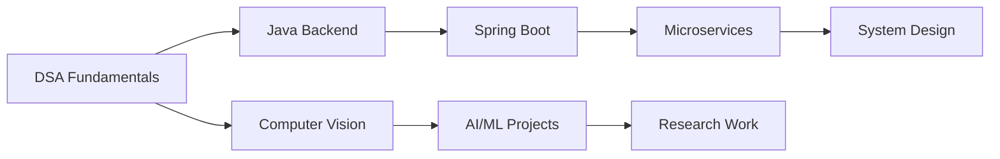

<div align="center">
  
# 👋 Hi, I'm Samarth Darak

### Computer Engineering Student | Aspiring Software Development Engineer

<p align="center">
  <em>Building scalable software systems and exploring the intersection of AI and Computer Vision</em>
</p>

[](https://linkedin.com/in/yourprofile)
[](https://github.com/samarthdarak24-cpu)
[](mailto:your.email@example.com)

</div>

---

## 🎓 About Me

I'm a **third-year Computer Engineering student at VIT Pune**, passionate about building efficient, scalable software systems. My journey spans from mastering **Data Structures & Algorithms** and **Java Backend Development** to exploring cutting-edge **AI and Computer Vision** technologies.

- 🎯 **Goal:** Secure a high-impact SDE role and contribute to large-scale production systems
- 💼 **Focus:** Building strong fundamentals while working on real-world projects
- 🔬 **Research:** Working on AI-powered computer vision projects with practical applications
- 📚 **Learning:** System design, microservices architecture, and advanced algorithms

---

## 🚀 Current Focus

```java
String[] currentFocus = {
    "Data Structures & Algorithms",
    "Java & Spring Boot Backend Development",
    "REST APIs & Microservices Architecture",
    "Database Design & SQL Optimization",
    "System Design Fundamentals",
    "Computer Vision & AI Applications"
};
```

---

## ⭐ Featured Projects

<table>
<tr>
<td width="50%">

### 🧠 AI & Computer Vision

#### [Kolam AI Research](https://github.com/samarthdarak24-cpu/kolam-ai)
AI-powered computer vision system for analyzing traditional rangoli patterns and generating structured Kolam designs.

**Tech:** `Python` `OpenCV` `Deep Learning` `Computer Vision`

---

#### [JewelFit 3D - Virtual Try-On](https://github.com/samarthdarak24-cpu/jewelfit-3d)
Real-time virtual jewelry try-on system using MediaPipe landmark detection and 3D rendering.

**Tech:** `MediaPipe` `JavaScript` `React` `3D Rendering`

</td>
<td width="50%">

### ☕ Java & Backend Development

#### [Spring Boot E-Commerce API](https://github.com/samarthdarak24-cpu/spring-boot-ecommerce)
Production-ready REST API with authentication, database integration, and layered architecture.

**Tech:** `Java` `Spring Boot` `MySQL` `JWT` `REST API`

---

#### [Electricity Bill Management System](https://github.com/samarthdarak24-cpu/bill-management)
Full-stack application for managing customers, meter readings, and automated billing calculations.

**Tech:** `Java` `SQL` `Web Technologies`

</td>
</tr>
<tr>
<td width="50%">

### 📚 DSA & Problem Solving

#### [DSA in Java](https://github.com/samarthdarak24-cpu/dsa-java)
Comprehensive implementations of data structures and algorithms with detailed explanations.

**Topics:** Arrays, Strings, Trees, Graphs, DP, Sorting, Searching

</td>
<td width="50%">

### 📄 Research Projects

#### [Research Publications](https://github.com/samarthdarak24-cpu/research-projects)
Research work on AI applications in cultural heritage preservation and pattern recognition.

**Areas:** Computer Vision, Pattern Analysis, AI Systems

</td>
</tr>
</table>

---

## 💻 Technical Skills

<table>
<tr>
<td valign="top" width="33%">

### Languages


</td>
<td valign="top" width="33%">

### Backend & Frameworks


</td>
<td valign="top" width="33%">

### AI & Computer Vision


</td>
</tr>
<tr>
<td valign="top" width="33%">

### Frontend


</td>
<td valign="top" width="33%">

### Databases


</td>
<td valign="top" width="33%">

### Tools & Technologies


</td>
</tr>
</table>

---

## 📚 Learning Journey



**Current Learning Path:**
- ✅ Core Data Structures & Algorithms
- ✅ Java Programming & OOP Concepts
- 🔄 Spring Boot & REST API Development
- 🔄 Database Design & Optimization
- 🔄 System Design Principles
- 🔄 Advanced Computer Vision Techniques
- 📋 Microservices Architecture
- 📋 Cloud Technologies (AWS/Azure)

---

## 📊 GitHub Statistics

<div align="center">
  


</div>

---

## 📈 Contribution Activity

<div align="center">
  


</div>

---

## 🏆 Achievements & Highlights

- 🎓 Computer Engineering at VIT Pune
- 💡 Published/Working on AI research in computer vision
- 🚀 Built production-level backend systems with Spring Boot
- 🧠 Solved 100+ DSA problems across multiple platforms
- 🔬 Developed real-world AI applications (Kolam AI, Virtual Try-On)
- 📚 Continuous learner with focus on scalable system design

---

## 🤝 Connect With Me

<div align="center">

Looking for **SDE internships and full-time opportunities** where I can contribute to building scalable systems and innovative solutions.

**Let's connect and collaborate!**

[](https://linkedin.com/in/yourprofile)
[](mailto:your.email@example.com)
[](https://github.com/samarthdarak24-cpu)

</div>

---

<div align="center">
  
### 💭 *"Code is like humor. When you have to explain it, it's bad." – Cory House*

**⭐ From [samarthdarak24-cpu](https://github.com/samarthdarak24-cpu)**

</div>
