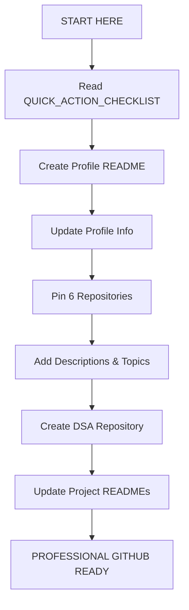

# 🎯 START HERE - Complete GitHub Profile Transformation Kit

<div align="center">

## 🔥 Everything You Need to Build a Professional GitHub Profile

**For: Samarth Darak | VIT Pune | SDE Aspirant**

</div>

---

## 📦 What's Included in This Kit?

I've created **5 comprehensive documents** to help you build a professional GitHub profile that will impress recruiters:

### 1. 📄 **PROFILE_README.md**
- **What:** Your complete GitHub profile README
- **Purpose:** This goes on your GitHub profile homepage
- **Action:** Copy this to your `samarthdarak24-cpu` repository
- **Time:** 5 minutes

### 2. 📖 **GITHUB_SETUP_GUIDE.md**
- **What:** Comprehensive step-by-step setup guide
- **Purpose:** Detailed instructions for every aspect of your profile
- **Action:** Read this for in-depth understanding
- **Time:** Reference document

### 3. ⚡ **QUICK_ACTION_CHECKLIST.md** ⭐ **START HERE!**
- **What:** Quick step-by-step action checklist
- **Purpose:** Complete your profile in 1-2 hours
- **Action:** Follow this checklist in order
- **Time:** 1-2 hours total

### 4. 📚 **DSA_REPOSITORY_TEMPLATE.md**
- **What:** Complete README template for DSA repository
- **Purpose:** Professional DSA repository setup
- **Action:** Use when creating `dsa-java` repository
- **Time:** 15 minutes

### 5. 🎨 **PROJECT_README_TEMPLATE.md**
- **What:** Professional README template for projects
- **Purpose:** Make every project look professional
- **Action:** Use for each of your projects
- **Time:** 20 minutes per project

---

## 🚀 Quick Start Guide

### If you have 5 minutes right now:
✅ Read this file  
✅ Open `QUICK_ACTION_CHECKLIST.md`  
✅ Complete **Step 1** (Create Profile README)

### If you have 30 minutes:
✅ Follow steps 1-3 in `QUICK_ACTION_CHECKLIST.md`  
✅ Your profile will already look 10x better!

### If you have 2 hours:
✅ Complete the entire `QUICK_ACTION_CHECKLIST.md`  
✅ Your GitHub will be recruiter-ready!

---

## 📋 Step-by-Step: What to Do

### STEP 1: Read the Quick Checklist (2 min)
```bash
Open: QUICK_ACTION_CHECKLIST.md
```
This gives you the fastest path to a professional profile.

### STEP 2: Create Your Profile README (5 min)
```bash
1. Open: PROFILE_README.md
2. Copy all content
3. Go to GitHub → Create new repo named "samarthdarak24-cpu"
4. Paste content into README.md
5. Update your links (LinkedIn, email)
```

### STEP 3: Follow the Checklist (1-2 hours)
```bash
Complete each checkbox in QUICK_ACTION_CHECKLIST.md
```

### STEP 4: Create DSA Repository (15 min)
```bash
1. Open: DSA_REPOSITORY_TEMPLATE.md
2. Create new repo: "dsa-java"
3. Use template for README
```

### STEP 5: Update Project READMEs (20 min each)
```bash
1. Open: PROJECT_README_TEMPLATE.md
2. Adapt for each of your projects
3. Commit changes
```

---

## 🎯 Your Transformation Roadmap



---

## 📊 Before vs After

### ❌ Before (Typical Student GitHub):
- No profile README
- Random repositories
- No descriptions
- No organization
- Basic profile info
- **Recruiter impression:** Beginner

### ✅ After (Professional Developer Portfolio):
- Professional profile README
- 6 pinned best projects
- Complete descriptions
- Clear organization
- Complete profile
- **Recruiter impression:** Hire this person!

---

## 🎓 Profile Structure You'll Build

```
Your GitHub Profile
│
├── 👤 Profile README (Professional introduction)
│
├── 📌 Pinned Repositories (6 best projects)
│   ├── 🧠 AI/Computer Vision Project
│   ├── ☕ Spring Boot Backend API
│   ├── 🌐 Full Stack Application
│   ├── 📚 DSA in Java
│   ├── 🎯 cpp-bro-codes (✅ Done!)
│   └── 📄 Research Project
│
├── 📊 GitHub Stats (Automatic)
│   ├── Contribution Graph
│   ├── Language Stats
│   └── Streak Counter
│
└── 🔗 Links
    ├── LinkedIn
    ├── Email
    └── Portfolio (optional)
```

---

## ⏱️ Time Investment Breakdown

| Task | Time | Priority |
|------|------|----------|
| **Profile README** | 5 min | 🔴 Do Now |
| **Profile Info** | 3 min | 🔴 Do Now |
| **Pin Repos** | 2 min | 🔴 Do Now |
| **Repo Descriptions** | 10 min | 🟡 Today |
| **DSA Repository** | 15 min | 🟡 Today |
| **Project READMEs** | 20 min each | 🟢 This Week |

**Total:** 1-2 hours for complete transformation

---

## 🔥 Why This Matters for Your SDE Career

### For Internships:
- ✅ Recruiters **WILL** check your GitHub
- ✅ Professional GitHub = Serious candidate
- ✅ Good documentation = Communication skills
- ✅ Organized projects = Attention to detail

### For Placements:
- ✅ Stand out from 100+ applicants
- ✅ Demonstrate practical skills
- ✅ Show consistent learning
- ✅ Build your personal brand

### For Long-term Career:
- ✅ Portfolio of your best work
- ✅ Showcase your growth
- ✅ Network with developers
- ✅ Contribute to open source

---

## 📂 Files in This Kit

| File | Size | Purpose | When to Use |
|------|------|---------|-------------|
| **START_HERE.md** | Overview | You are here! | Right now |
| **QUICK_ACTION_CHECKLIST.md** | Checklist | Fast implementation | Next step |
| **GITHUB_SETUP_GUIDE.md** | 2000+ words | Detailed guide | Reference |
| **PROFILE_README.md** | Template | Profile homepage | Copy to GitHub |
| **DSA_REPOSITORY_TEMPLATE.md** | Template | DSA repo | When creating DSA repo |
| **PROJECT_README_TEMPLATE.md** | Template | Project docs | For each project |

---

## 🎯 Success Checklist

After completing everything, you should have:

- [ ] Professional profile README on your GitHub homepage
- [ ] Complete profile with bio, photo, location, company
- [ ] 6 repositories pinned showing your best work
- [ ] All repositories have descriptions and topics
- [ ] DSA repository created and structured
- [ ] At least 2-3 projects have professional READMEs
- [ ] Active contribution graph (commit regularly)
- [ ] All links work (LinkedIn, email, etc.)

---

## 💡 Pro Tips

1. **Do Step 1-3 TODAY** - Gets you 70% of the way there in 10 minutes
2. **One project README per day** - Finish all projects in a week
3. **Commit daily** - Even small changes keep your graph green
4. **Quality > Quantity** - 6 great projects > 20 mediocre ones
5. **Keep it updated** - Review and update monthly

---

## 🚀 Ready to Start?

### Right Now (Next 5 Minutes):

1. ✅ Open `QUICK_ACTION_CHECKLIST.md`
2. ✅ Go to GitHub.com
3. ✅ Create new repository: `samarthdarak24-cpu`
4. ✅ Copy content from `PROFILE_README.md`
5. ✅ Paste into your new repository's README

### After That:

6. ✅ Continue with remaining steps in the checklist
7. ✅ Take your time, but be consistent
8. ✅ Your future SDE career starts with this profile!

---

## 📞 Questions?

If you get stuck or need clarification on any step:

1. Check the `GITHUB_SETUP_GUIDE.md` for detailed explanations
2. Look at the specific template for that section
3. Ask me for help with specific steps

---

## 🎓 What Recruiters Will See

When a recruiter visits your GitHub after completing this:

1. **First Impression (3 seconds):**
   - ✅ Professional README with your info
   - ✅ Clear title: "Computer Engineering Student | SDE Aspirant"
   - ✅ Skills and technologies visible

2. **Quick Scan (10 seconds):**
   - ✅ 6 pinned projects showing diverse skills
   - ✅ Active contribution graph
   - ✅ Clear descriptions on all repos

3. **Deeper Look (30 seconds):**
   - ✅ Professional project READMEs
   - ✅ Code quality and organization
   - ✅ Consistent commits and updates

4. **Decision:**
   - ✅ "This candidate is serious and professional"
   - ✅ "Let's move forward with an interview"

---

## 🏆 Final Motivation

You're a **third-year Computer Engineering student at VIT Pune** with:
- ✅ AI/Computer Vision projects
- ✅ Java backend skills
- ✅ Spring Boot experience
- ✅ DSA knowledge
- ✅ Research work

**You have the skills. Now show them professionally.**

This kit gives you everything you need to transform your GitHub from a code storage into a **professional developer portfolio** that opens doors to internships and SDE positions.

---

<div align="center">

## 🔥 Your SDE Journey Starts Now

### Next Action: Open `QUICK_ACTION_CHECKLIST.md` and start Step 1

**Time to build the GitHub profile that gets you hired!** 💪

---

**Created for:** Samarth Darak  
**Date:** January 2025  
**Goal:** Professional GitHub → SDE Internship → High-Paying SDE Role

</div>
